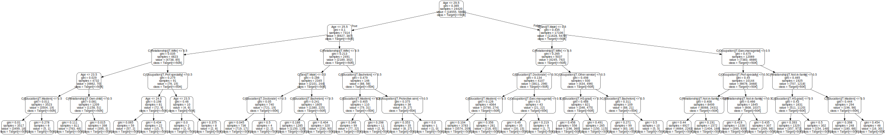
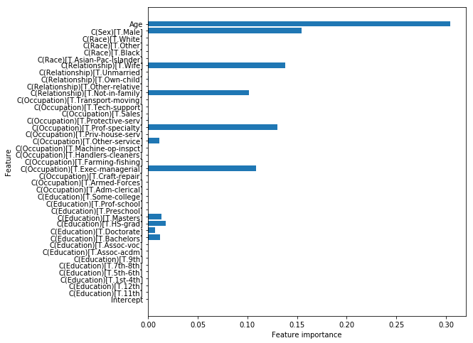
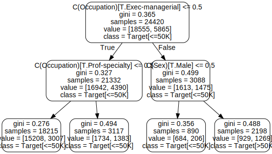
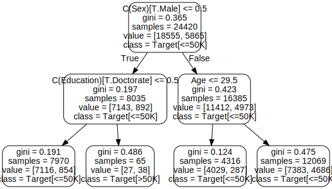
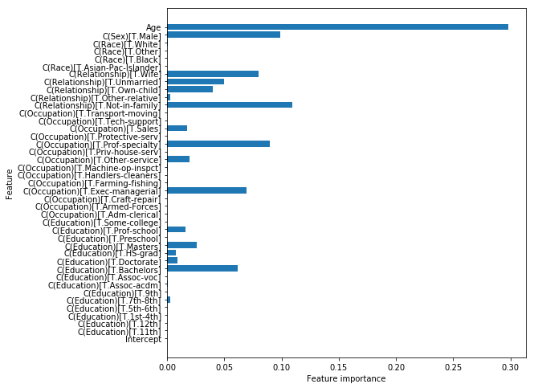
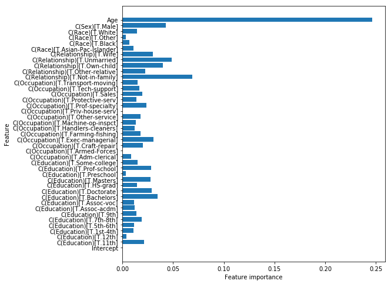
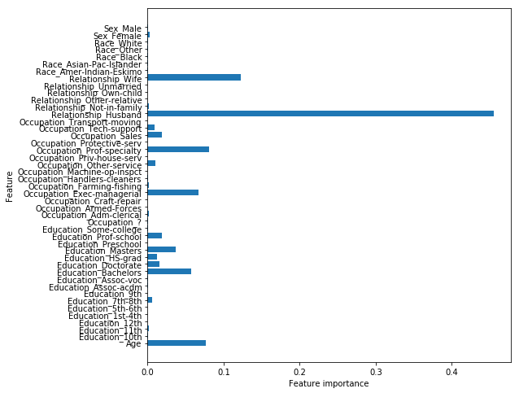
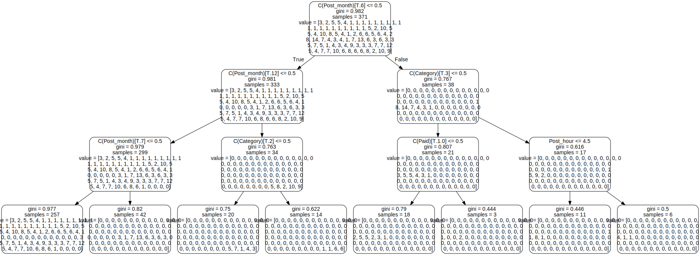

# Ensemble methods

## 1. Importing the data

We'll use the same data set whe used in the last lab. The salary data set was extracted from the census bureau database and contains salary information. The goal is to use this data set and to try to draw conclusions regarding what drives salaries. More specifically, the target variable is categorical (> 50k; <= 50 k). Let's create a classification tree!


```python
import pandas as pd
import numpy as np
import statsmodels as sm
import matplotlib.pyplot as plt
import sklearn as skl
import sklearn.preprocessing as preprocessing
import sklearn.linear_model as linear_model
from sklearn.cross_validation import train_test_split
import sklearn.metrics as metrics
import sklearn.tree as tree
import seaborn as sns
import graphviz 
from sklearn.tree import export_graphviz
```

    /anaconda3/lib/python3.6/site-packages/sklearn/cross_validation.py:41: DeprecationWarning: This module was deprecated in version 0.18 in favor of the model_selection module into which all the refactored classes and functions are moved. Also note that the interface of the new CV iterators are different from that of this module. This module will be removed in 0.20.
      "This module will be removed in 0.20.", DeprecationWarning)


```python
salaries = pd.read_csv("salaries_final.csv", index_col = 0)
```

In total, there are 6 predictors, and one outcome variable, the target salary <= 50k/ >50k.

recall that the 6 predictors are:

- `Age`: continuous.

- `Education`: Categorical. Bachelors, Some-college, 11th, HS-grad, Prof-school, Assoc-acdm, Assoc-voc, 9th, 7th-8th, 12th, 
Masters, 1st-4th, 10th, Doctorate, 5th-6th, Preschool.

- `Occupation`: Tech-support, Craft-repair, Other-service, Sales, Exec-managerial, Prof-specialty, Handlers-cleaners, Machine-op-inspct, Adm-clerical, Farming-fishing, Transport-moving, Priv-house-serv, Protective-serv, Armed-Forces.

- `Relationship`: Wife, Own-child, Husband, Not-in-family, Other-relative, Unmarried.

- `Race`: White, Asian-Pac-Islander, Amer-Indian-Eskimo, Other, Black.

- `Sex`: Female, Male.


```python
salaries.head()
```


<div>
<style scoped>
    .dataframe tbody tr th:only-of-type {
        vertical-align: middle;
    }

    .dataframe tbody tr th {
        vertical-align: top;
    }

    .dataframe thead th {
        text-align: right;
    }
</style>
<table border="1" class="dataframe">
  <thead>
    <tr style="text-align: right;">
      <th></th>
      <th>Age</th>
      <th>Education</th>
      <th>Occupation</th>
      <th>Relationship</th>
      <th>Race</th>
      <th>Sex</th>
      <th>Target</th>
    </tr>
  </thead>
  <tbody>
    <tr>
      <th>0</th>
      <td>39</td>
      <td>Bachelors</td>
      <td>Adm-clerical</td>
      <td>Not-in-family</td>
      <td>White</td>
      <td>Male</td>
      <td>&lt;=50K</td>
    </tr>
    <tr>
      <th>1</th>
      <td>50</td>
      <td>Bachelors</td>
      <td>Exec-managerial</td>
      <td>Husband</td>
      <td>White</td>
      <td>Male</td>
      <td>&lt;=50K</td>
    </tr>
    <tr>
      <th>2</th>
      <td>38</td>
      <td>HS-grad</td>
      <td>Handlers-cleaners</td>
      <td>Not-in-family</td>
      <td>White</td>
      <td>Male</td>
      <td>&lt;=50K</td>
    </tr>
    <tr>
      <th>3</th>
      <td>53</td>
      <td>11th</td>
      <td>Handlers-cleaners</td>
      <td>Husband</td>
      <td>Black</td>
      <td>Male</td>
      <td>&lt;=50K</td>
    </tr>
    <tr>
      <th>4</th>
      <td>28</td>
      <td>Bachelors</td>
      <td>Prof-specialty</td>
      <td>Wife</td>
      <td>Black</td>
      <td>Female</td>
      <td>&lt;=50K</td>
    </tr>
  </tbody>
</table>
</div>


Let's use `dmatrices` again to get to the right format to start making our trees.


```python
from patsy import dmatrices
target, data = dmatrices('Target ~ Age + C(Education) + \
                  C(Occupation) + C(Relationship) + C(Race) + C(Sex)',
                  salaries, return_type = "dataframe")
```

Make a train and test split


```python
data_train, data_test, target_train, target_test = train_test_split(data, target, 
                                                                   test_size = 0.25, random_state=123)
```

## 2. Let's rebuild a "regular" tree as a baseline

### 2.1 Building the tree


```python
from sklearn import tree
tree = tree.DecisionTreeClassifier(criterion = "gini", max_depth = 5) 
tree = tree.fit(data_train, target_train.iloc[:,1])

export_graphviz(tree, out_file="mytree.dot", feature_names=data_train.columns , class_names=list(target_train), rounded=True)
with open("mytree.dot") as f:
    dot_graph = f.read()
graphviz.Source(dot_graph)
```





### 2.1 Feature importance


```python
tree.feature_importances_
```


    array([0.        , 0.        , 0.        , 0.        , 0.        ,
           0.        , 0.        , 0.        , 0.        , 0.01174726,
           0.00731382, 0.01770231, 0.01362388, 0.        , 0.        ,
           0.        , 0.        , 0.        , 0.        , 0.10865096,
           0.        , 0.        , 0.        , 0.01126856, 0.        ,
           0.13019604, 0.00045497, 0.        , 0.        , 0.        ,
           0.10188485, 0.        , 0.00056004, 0.        , 0.13774195,
           0.        , 0.        , 0.        , 0.        , 0.15438617,
           0.30446918])


```python
def plot_feature_importances(model):
    n_features = data_train.shape[1]
    plt.figure(figsize=(8,8))
    plt.barh(range(n_features), model.feature_importances_, align='center') 
    plt.yticks(np.arange(n_features), data_train.columns.values) 
    plt.xlabel("Feature importance")
    plt.ylabel("Feature")

plot_feature_importances(tree)
```





### 2.3 Model performance


```python
from sklearn.metrics import accuracy_score
```


```python
pred= tree.predict(data_test)
print(metrics.confusion_matrix(target_test.iloc[:,1], pred))
print(metrics.classification_report(target_test.iloc[:,1], pred))
```

    [[5825  340]
     [1201  775]]
                 precision    recall  f1-score   support
    
            0.0       0.83      0.94      0.88      6165
            1.0       0.70      0.39      0.50      1976
    
    avg / total       0.80      0.81      0.79      8141
    


```python
accuracy_score(target_test.iloc[:,1], pred)
```


    0.810711214838472


## 3. Bagged trees


```python
from sklearn.ensemble import BaggingClassifier
from sklearn import tree

```


```python
bagged_tree =  BaggingClassifier(tree.DecisionTreeClassifier(criterion = "gini", max_depth = 5), n_estimators=20)
```


```python
bagged_tree.fit(data_train, target_train.iloc[:,1])
```


    BaggingClassifier(base_estimator=DecisionTreeClassifier(class_weight=None, criterion='gini', max_depth=5,
                max_features=None, max_leaf_nodes=None,
                min_impurity_decrease=0.0, min_impurity_split=None,
                min_samples_leaf=1, min_samples_split=2,
                min_weight_fraction_leaf=0.0, presort=False, random_state=None,
                splitter='best'),
             bootstrap=True, bootstrap_features=False, max_features=1.0,
             max_samples=1.0, n_estimators=20, n_jobs=1, oob_score=False,
             random_state=None, verbose=0, warm_start=False)


```python
bagged_tree.score(data_train, target_train.iloc[:,1])
```


    0.8171580671580672


```python
bagged_tree.score(data_test, target_test.iloc[:,1])
```


    0.816361626335831


## 4. Random forests

### 4.1 Fitting a random forests model


```python
from sklearn.ensemble import RandomForestClassifier 
```

The default for `max_features` is `auto`. This means sqrt(total n of features) 


```python
forest = RandomForestClassifier(n_estimators=100, max_features= 20, random_state=123, max_depth= 5)
forest.fit(data_train, target_train)
```


    RandomForestClassifier(bootstrap=True, class_weight=None, criterion='gini',
                max_depth=5, max_features=20, max_leaf_nodes=None,
                min_impurity_decrease=0.0, min_impurity_split=None,
                min_samples_leaf=1, min_samples_split=2,
                min_weight_fraction_leaf=0.0, n_estimators=100, n_jobs=1,
                oob_score=False, random_state=123, verbose=0, warm_start=False)


```python
forest.score(data_train, target_train)
```


    0.8177313677313678


```python
forest.score(data_test, target_test)
```


    0.8170986365311387


### 4.2 Look at the feature importances


```python
plot_feature_importances(forest)
```


Note: "relationship" represents what this individual is relative to others. For example an
individual could be a Husband. Each entry only has one relationship, so it is a bit of a weird attribute.

Note that more geatures show up. This is a pretty typical result. 

### 4.3 Look at the trees in your forest

Let's create a forest with some small trees. You'll learn how to access trees in your forest!


```python
forest_2 = RandomForestClassifier(n_estimators = 5, max_features= 10, random_state=123, max_depth= 2)
forest_2.fit(data_train, target_train)
```


    RandomForestClassifier(bootstrap=True, class_weight=None, criterion='gini',
                max_depth=2, max_features=10, max_leaf_nodes=None,
                min_impurity_decrease=0.0, min_impurity_split=None,
                min_samples_leaf=1, min_samples_split=2,
                min_weight_fraction_leaf=0.0, n_estimators=5, n_jobs=1,
                oob_score=False, random_state=123, verbose=0, warm_start=False)


Making `max_features` smaller will lead to very different trees in your forest!

The trees in your forest are stored in the `.estimators_` attribute.


```python
forest_2.estimators_[0]
```


    DecisionTreeClassifier(class_weight=None, criterion='gini', max_depth=2,
                max_features=10, max_leaf_nodes=None,
                min_impurity_decrease=0.0, min_impurity_split=None,
                min_samples_leaf=1, min_samples_split=2,
                min_weight_fraction_leaf=0.0, presort=False,
                random_state=843828734, splitter='best')


```python
forest_2.estimators_[1]
```


    DecisionTreeClassifier(class_weight=None, criterion='gini', max_depth=2,
                max_features=10, max_leaf_nodes=None,
                min_impurity_decrease=0.0, min_impurity_split=None,
                min_samples_leaf=1, min_samples_split=2,
                min_weight_fraction_leaf=0.0, presort=False,
                random_state=914636141, splitter='best')


```python
tree_1 = forest_2.estimators_[0].fit(data_train, target_train.iloc[:,1])
```


```python
export_graphviz(tree_1, out_file="mytree.dot", feature_names=data_train.columns , class_names=list(target_train), rounded=True)
with open("mytree.dot") as f:
    dot_graph = f.read()
graphviz.Source(dot_graph)
```





```python
tree_2 = forest_2.estimators_[1].fit(data_train, target_train.iloc[:,1])
export_graphviz(tree_2, out_file="mytree.dot", feature_names=data_train.columns , class_names=list(target_train), rounded=True)
with open("mytree.dot") as f:
    dot_graph = f.read()
graphviz.Source(dot_graph)
```





## 5. Gradient boosting

### 5.1 GBRT


```python
from sklearn.ensemble import GradientBoostingClassifier
```

#### 5.1.1 Fitting a GBRT model


```python
gradboost = GradientBoostingClassifier(random_state = 123, max_depth = 5, learning_rate = 0.01)
gradboost.fit(data_train, target_train.iloc[:,1])
```


    GradientBoostingClassifier(criterion='friedman_mse', init=None,
                  learning_rate=0.01, loss='deviance', max_depth=5,
                  max_features=None, max_leaf_nodes=None,
                  min_impurity_decrease=0.0, min_impurity_split=None,
                  min_samples_leaf=1, min_samples_split=2,
                  min_weight_fraction_leaf=0.0, n_estimators=100,
                  presort='auto', random_state=123, subsample=1.0, verbose=0,
                  warm_start=False)


```python
gradboost.score(data_train, target_train.iloc[:,1])
```


    0.8041359541359542


```python
gradboost.score(data_test, target_test.iloc[:,1])
```


    0.8024812676575359


```python
plot_feature_importances(gradboost)
```





This isn't really an improvement compared to our Random forests. We told you that gradient boosting methods can generate excellent results, if you set your hyperparameters right! As you know, gradient descent is a delicate process and the learning rate should be set correctly. Let's have a look at what changing the learning rate does to our model.

#### 5.1.2 Changing the learning rate


```python
gradboost_2 = GradientBoostingClassifier(random_state = 123, max_depth = 5, learning_rate = 0.09)
gradboost_2.fit(data_train, target_train.iloc[:,1])
```


    GradientBoostingClassifier(criterion='friedman_mse', init=None,
                  learning_rate=0.09, loss='deviance', max_depth=5,
                  max_features=None, max_leaf_nodes=None,
                  min_impurity_decrease=0.0, min_impurity_split=None,
                  min_samples_leaf=1, min_samples_split=2,
                  min_weight_fraction_leaf=0.0, n_estimators=100,
                  presort='auto', random_state=123, subsample=1.0, verbose=0,
                  warm_start=False)


```python
gradboost_2.score(data_train, target_train.iloc[:,1])
```


    0.8422604422604423


```python
gradboost_2.score(data_test, target_test.iloc[:,1])
```


    0.8354010563812799


```python
plot_feature_importances(gradboost_2)
```





The feature importances plot has changed drastically! This model is definitely more complex, as mentioned in the lecture.

### 5.2 AdaBoost


```python
from sklearn.ensemble import AdaBoostClassifier
```


```python
adaboost = AdaBoostClassifier(random_state = 123, n_estimators=100)
adaboost.fit(data_train, target_train.iloc[:,1])
```


    AdaBoostClassifier(algorithm='SAMME.R', base_estimator=None,
              learning_rate=1.0, n_estimators=100, random_state=123)


```python
adaboost.score(data_train, target_train.iloc[:,1])
```


    0.8350941850941851


```python
adaboost.score(data_test, target_test.iloc[:,1])
```


    0.8355238914138312


```python
plot_feature_importances(adaboost)
```





Seems to be performing similarly to gradient boosting, even more focus on Age.

## 6. To wrap up: let's look at a regression tree


```python
# load dataset
data = pd.read_csv("dataset_Facebook.csv", sep = ";", header=0)
data = data.dropna()
data.head()
```


<div>
<style scoped>
    .dataframe tbody tr th:only-of-type {
        vertical-align: middle;
    }

    .dataframe tbody tr th {
        vertical-align: top;
    }

    .dataframe thead th {
        text-align: right;
    }
</style>
<table border="1" class="dataframe">
  <thead>
    <tr style="text-align: right;">
      <th></th>
      <th>Page total likes</th>
      <th>Type</th>
      <th>Category</th>
      <th>Post Month</th>
      <th>Post Weekday</th>
      <th>Post Hour</th>
      <th>Paid</th>
      <th>Lifetime Post Total Reach</th>
      <th>Lifetime Post Total Impressions</th>
      <th>Lifetime Engaged Users</th>
      <th>Lifetime Post Consumers</th>
      <th>Lifetime Post Consumptions</th>
      <th>Lifetime Post Impressions by people who have liked your Page</th>
      <th>Lifetime Post reach by people who like your Page</th>
      <th>Lifetime People who have liked your Page and engaged with your post</th>
      <th>comment</th>
      <th>like</th>
      <th>share</th>
      <th>Total Interactions</th>
    </tr>
  </thead>
  <tbody>
    <tr>
      <th>0</th>
      <td>139441</td>
      <td>Photo</td>
      <td>2</td>
      <td>12</td>
      <td>4</td>
      <td>3</td>
      <td>0.0</td>
      <td>2752</td>
      <td>5091</td>
      <td>178</td>
      <td>109</td>
      <td>159</td>
      <td>3078</td>
      <td>1640</td>
      <td>119</td>
      <td>4</td>
      <td>79.0</td>
      <td>17.0</td>
      <td>100</td>
    </tr>
    <tr>
      <th>1</th>
      <td>139441</td>
      <td>Status</td>
      <td>2</td>
      <td>12</td>
      <td>3</td>
      <td>10</td>
      <td>0.0</td>
      <td>10460</td>
      <td>19057</td>
      <td>1457</td>
      <td>1361</td>
      <td>1674</td>
      <td>11710</td>
      <td>6112</td>
      <td>1108</td>
      <td>5</td>
      <td>130.0</td>
      <td>29.0</td>
      <td>164</td>
    </tr>
    <tr>
      <th>2</th>
      <td>139441</td>
      <td>Photo</td>
      <td>3</td>
      <td>12</td>
      <td>3</td>
      <td>3</td>
      <td>0.0</td>
      <td>2413</td>
      <td>4373</td>
      <td>177</td>
      <td>113</td>
      <td>154</td>
      <td>2812</td>
      <td>1503</td>
      <td>132</td>
      <td>0</td>
      <td>66.0</td>
      <td>14.0</td>
      <td>80</td>
    </tr>
    <tr>
      <th>3</th>
      <td>139441</td>
      <td>Photo</td>
      <td>2</td>
      <td>12</td>
      <td>2</td>
      <td>10</td>
      <td>1.0</td>
      <td>50128</td>
      <td>87991</td>
      <td>2211</td>
      <td>790</td>
      <td>1119</td>
      <td>61027</td>
      <td>32048</td>
      <td>1386</td>
      <td>58</td>
      <td>1572.0</td>
      <td>147.0</td>
      <td>1777</td>
    </tr>
    <tr>
      <th>4</th>
      <td>139441</td>
      <td>Photo</td>
      <td>2</td>
      <td>12</td>
      <td>2</td>
      <td>3</td>
      <td>0.0</td>
      <td>7244</td>
      <td>13594</td>
      <td>671</td>
      <td>410</td>
      <td>580</td>
      <td>6228</td>
      <td>3200</td>
      <td>396</td>
      <td>19</td>
      <td>325.0</td>
      <td>49.0</td>
      <td>393</td>
    </tr>
  </tbody>
</table>
</div>


```python
facebook = data[["Page total likes","Type", "Category", "Post Month", "Post Weekday", "Post Hour", "Paid"]]
```


```python
facebook = facebook.rename(index=str, columns={"Page total likes": "Likes", "Post Month": "Post_month", "Post Weekday": "Post_day", "Post Hour": "Post_hour" })
```


```python
likes, fb_data = dmatrices('Likes ~ C(Category) + C(Post_month)+ \
                 C(Post_day) + Post_hour + C(Paid) + C(Type)',
                  facebook, return_type = "dataframe")
```


```python
fb_train, fb_test, likes_train, likes_test = train_test_split(fb_data, likes, 
                                                                   test_size = 0.25, random_state=123)
from sklearn import tree
tree = tree.DecisionTreeClassifier(max_depth = 3) 
tree = tree.fit(fb_train, likes_train)

export_graphviz(tree, out_file="mytree.dot", feature_names=fb_train.columns, rounded=True)
with open("mytree.dot") as f:
    dot_graph = f.read()
graphviz.Source(dot_graph)
```





TO DO fix so values are taken out

# Sources
https://www.svds.com/machine-learning-vs-statistics/ 

https://github.com/xbno/Projects/blob/master/Models_Scratch/Decision%20Trees%20from%20scratch.ipynb

http://scikit-learn.org/stable/modules/generated/sklearn.ensemble.RandomForestClassifier.html

http://scikit-learn.org/stable/modules/ensemble.html


Raschka and Mirjalili

Muller and Guido


https://machinelearningmastery.com/ensemble-machine-learning-algorithms-python-scikit-learn/
